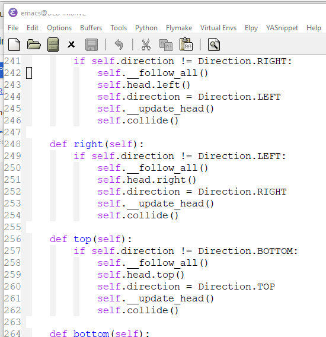

_Emacs to świetny system operacyjny, ale brakuje mu dobrego edytora_ — czasami można usłyszeć takie zdanie, ale to oczywiście nieprawda. Najwyżej można zgodzić się z tym, że współczesne edytory mają zbyt dużo bajerów, a w Emacsie trzeba pochylić się trochę głębiej nad konfiguracją żeby uzyskać podobny efekt, co i tak procentuje na przyszłość.

Jakiś czas temu zapytano mnie, w jaki sposób wyświetlić numery linii w buforach Edytora, a odpowiedź jest jedynie słuszna: użyj linum-mode, Luke

linum-mode jest dodatkowym trybem (minor-mode) do wyświetlania numerów linii po lewej stronie bufora, na specjalnie do tego stworzonym marginesie. Przyszedł wraz z wersją 22.

Wystarczy wywołać:

```elisp
M-x linum-mode
```

i całość zacznie wyglądać, jak poniżej:



`customize-mode` pozwoli na ustawienie formatu wyświetlanych napisów, użytej czcionki, kolorów, automatycznego ładowania trybu dla każdego otwierania bufora i tak dalej.