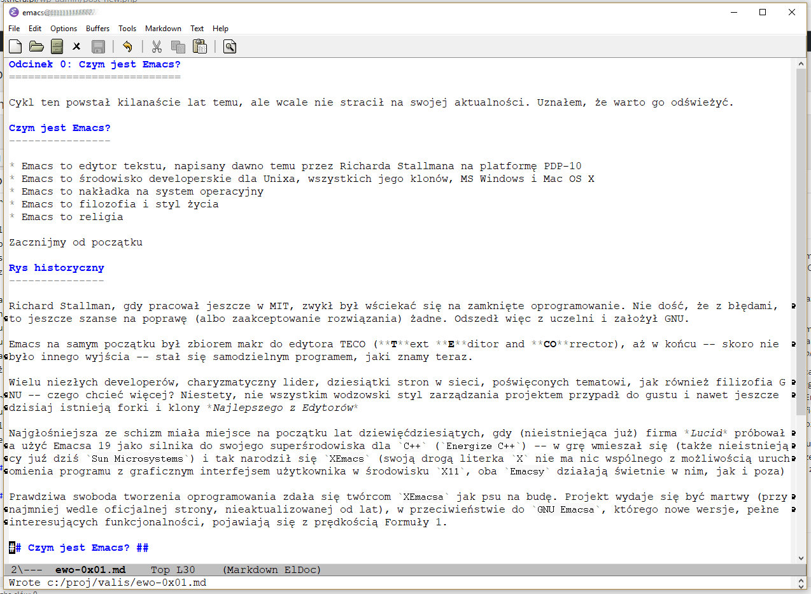

Odcinek 0: Czym jest `Emacs`?
===========================

Cykl ten powstał kilkanaście lat temu, ale wcale nie stracił na swojej aktualności. Uznałem, że warto go odświeżyć.

Czym jest `Emacs`?
----------------

* `Emacs` to edytor tekstu, napisany dawno temu przez Richarda Stallmana na platformę PDP-10
* `Emacs` to środowisko developerskie dla Unixa, wszystkich jego klonów, MS Windows i Mac OS X
* `Emacs` to nakładka na system operacyjny
* `Emacs` to filozofia i styl życia
* `Emacs` to religia

Zacznijmy od początku

Rys historyczny
---------------

Richard Stallman, gdy pracował jeszcze w *MIT*, zwykł był wściekać się na zamknięte oprogramowanie. Nie dość, że z błędami, to jeszcze szanse na poprawę (albo zaakceptowanie rozwiązania) żadne. Odszedł więc z uczelni i założył `GNU`.

`Emacs` na samym początku był zbiorem makr do edytora `TECO` (**T**ext **E**ditor and **CO**rrector), aż w końcu -- skoro nie było innego wyjścia -- stał się samodzielnym programem, jaki znamy teraz.

Wielu niezłych developerów, charyzmatyczny lider, dziesiątki stron w sieci, poświęconych tematowi, jak również filizofia `GNU` -- czego chcieć więcej? Niestety, nie wszystkim wodzowski styl zarządzania projektem przypadł do gustu i nawet jeszcze dzisiaj istnieją forki i klony *Najlepszego z Edytorów*

Najgłośniejsza ze schizm miała miejsce na początku lat dziewięćdziesiątych, gdy (nieistniejąca już) firma *Lucid* próbowała użyć `Emacsa 19` jako silnika do swojego superśrodowiska dla `C++` (`Energize C++`) -- w grę wmieszał się (także nieistniejący juź dziś `Sun Microsystems`) i tak narodził się `XEmacs` (swoją drogą literka `X` nie ma nic wspólnego z możliwością uruchomienia programu z graficznym interfejsem użytkownika w środowisku `X11`, oba `Emacsy` działają świetnie w nim, jak i poza)

Prawdziwa swoboda tworzenia oprogramowania zdała się twórcom `XEmacsa` jak psu na budę. Projekt wydaje się być martwy (przynajmniej wedle oficjalnej strony, nieaktualizowanej od lat), w przeciwieństwie do `GNU Emacsa`, którego nowe wersje, pełne interesujących funkcjonalności, pojawiają się z prędkością Formuły 1.

## Czym jest `Emacs`? ##

### Edytorem tekstu ###

To w zasadzie główny cel zespołu developerskiego: napisać najlepszy na świecie edytor tekstu. Kod źródłowy, listy do cioci, publikacja naukowa w `TeXu`? Jak najbardziej! (trzeba przyznać, podgląd pliku `.dvi` w locie robi wrażenie)

### Zintegrowanym środowiskiem dla programistów ###

Kolorowanie składni dla tysięcy języków, obsługa różnych kompilatorów i interpreterów, wiersz poleceń, emulator terminala, obsługa różnych debuggerów, kontrola wersji i zarządzanie projektem -- czego chcieć więcej?

### Kompilatorem i interpreterem Lispa ###

Dziś powiedzielibyśmy: *Maszyną Wirtualną Lispa*. Silnikiem, który stanowi o tym, czym `Emacs` jest teraz, a bez czego zwyczanie nie istniałby.

### Czym `Emacs` nie jest? ###

Edytorem *Sześć*, MS Visual Studio, MS Wordem, Xcode i podobnymi.

Na szczęście.

