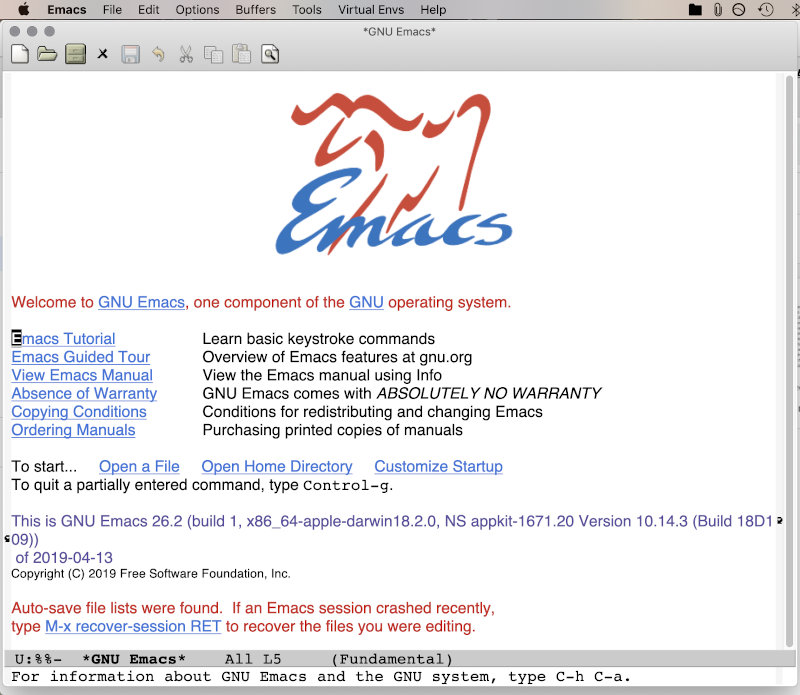

# Kilka chwytów na gitarę klasyczną #

## Instalacja ##

Najlepszy z Edytorów instaluje się bardzo prosto.

W środowisku Windows wystarczy rozpakować oficjalne archiwum w formacie zip z binariami do osobnego katalogu. Załączony tam plik wykonywalny `emacs.exe` (w `bin`) jest głównym plikiem wykonywalnym programu.

W systemach linuksowych bądź BSD wystarczy skorzystać z pakietów, przygotowanych przez opiekunów dystrybucji, kompilować źródeł nie warto -- samo skompletowanie zależności potrwa o wiele dłużej. Lepiej użyć menedżera pakietów i zainstalować z oficjalnego repozytorium -- zwykle jest w nim najnowsza wersja Edytora.

Swój pakiet z `Emacsem` ma również `Cygwin`, zarówno w postaci właściwej dla siebie (charakterystyczne ścieżki, tryb okienkowy wymagający X11), jak i wersję przygotowaną dla `win32`.

### W Mac OS X... ###

Istnieją dwie twarze Mac OS X: ta oficjalna, reklamowana przez jabłkową firmę, z pięknym interfejsem użytkownika i dziwną filozofią pracy, i ta druga, o dużo bardziej ludzkiej twarzy, będąca lekko wykastrowanym forkiem FreeBSD (system plików z nazwami nie będącymi `case-sensitive`? Serio?)

Dwie natywne wersje Emacsa, warte uwagi, to:

* Emacs For Mac OS X: [https://emacsformacosx.com](https://emacsformacosx.com)
* Aquamacs: [http://aquamacs.org](http://aquamacs.org)

Ten drugi na pierwszy rzut oka wydaje się mniej podobny do oryginału, ale za to domyślnie obsługuje choćby wszystkie skróty klawiszowe, które firma _Apple_ lansuje w całym systemie: `japko-C`, `japko-V`, `japko-O`, `japko-S` i tak dalej (o tym, jak przedefiniować absolutnie każdą kombinację klawiszy wedle własnego upodobania będzie w jednym z następnych odcinków)

Wystarczy ściągnąć z podanych stron wersję instalacyjną (obraz `dmg`), otworzyć, a później przeciągnąć ikonę programu do folderu `Applications` i chwilę poczekać. `Aquamacs` jest już trochę leciwy, bazuje na `GNU Emacs` `25.3`, a podczas redagowania tego tekstu od pół roku była już dostępna wersja `26.2`. `Emacs for Mac Os X` zawiera zwykle binaria najświeższej z możliwych wersji.

Ta bardziej ludzka twarz systemu to oczywiście wiersz poleceń, terminal i emulacja X11. Mac OS X to na nowo skrojony FreeBSD, gdzie żaden zaawansowany system portów, zgodnie z filozofią, potrzebny nie jest -- na szczęście Internet pełen jest ochotników, którzy nadrobili zaległości w ulubionym (yyy...) systemie. Z całej długiej listy kolekcji i portów warte uwagi są dwa: `brew` i `MacPorts`.

W tym pierwszym instalujemy Edytor poprzez wydanie polecenia:

`$ brew install emacs`

W tym drugim:

`$ sudo ports install emacs-app`

Ważne: trzeba mieć `Xcode`, w którym wcześniej należy zaakceptować licencję.

## Uruchamianie ##

W systemach uniksowych plik wykonywalny to po prostu `emacs`, znajduje się gdzieś na ścieżce wyszukiwania.

Dla popularnych menedżerów okien (środowisk? pulpitów?) w X11 z pewnością istnieje już (został stworzony podczas instalacji) odpowiedni wpis w menu z aplikacjami.

W Mac OS X wystarczy użyć `Spotlight` do wyszukania `Emacsa`, wersja budowana z portów znajduje się np w `/Applications/MacPorts/Emacs.app`. `Emacsa` w trybie tekstowym można śmiało uruchomić z terminala.

### W Środowisku Windows... ###

Cygwinowego `Emacsa` najłatwiej uruchomić, wpisując `emacs` w okienku terminala.

W przypadku natywnych wersji trzeba zlokalizować katalog instalacyjny, odnaleźć w nim plik `emacs.exe` w podkatalogu `bin` i uruchomić, albo utworzyć do niego skrót w widocznym miejscu. Właściwie to `emacs.exe` uruchamia kolejny plik wykonywalny, `runemacs.exe` i to ten drugi jest właściwą instancją `Emacsa`. Niby nic, ale w `Windows 7` lub nowszych uruchomiony `Emacs` ładuje się na pasku zadań obok ikonki skrótu (wygląda to conajmniej niestandardowo, ale w sumie nie przeszkadza w niczym)

## Koń, jaki jest, każdy widzi ##

Po uruchomieniu (w jakikolwiek sposób) oczom naszym ukazuje się... coś. Prostokąt z menu głównym i garścią informacji. W trybie graficznym dodatkowo wyświetlone jest logo, stylizowane na antylopę gnu.

Pierwsze edytory tekstu powstawały w czasach terminali znakowych -- ekran monitora był po prostu buforem na literki, ogólnego przeznaczenia. Gdy autorzy wprowadzili możliwość podziału obszaru roboczego na mniejsze części, każdą z nich nazwali **oknem**, które istnieje do dziś, natomiast to, co w środowiskach graficznych jest prawdziwym oknem, nosi miano **ramki**.

Jedna ramka może zawierać jedno lub więcej okien, cały program może wyświetlić tyle ramek, na ile pozwoli mu środowisko graficzne lub ograniczenia systemu operacyjnego (w terminalu znakowym ramka z oczywistych względów może być tylko jedna); wszystkie ramki mogą w szczególnym przypadku pokazywać ten sam plik!

Wyświetlany obiekt wcale nie musi być plikiem, co więcej -- w ogóle nie musi mieć odzwierciedlenia w systemie plików, może być chociażby i obrazkiem -- autorzy w tym celu wprowadzili nazwę bufora.

Podsumowanie: `Emacs` składa się z **ramki** lub **ramek**, podzielonych na jedno lub więcej **okien**, które z kolei wyświetlają zawartość **buforów**. Co jeszcze? Menu, pasek z narzędziami (tam, gdzie to możliwe) i paski przewijania zapewnia środowisko graficzne (tekstowe trochę mniej). Sam edytor wyświetla jeszcze **linię statusu** (zawierającą ważne i ciekawe informacje) i **minibufor** (tutaj wprowadza się odpowiedź, gdy `Emacs` grzecznie zapyta)

Polecenie `emacs`, plik wykonywalny `emacs.exe` lub `Emacs.app` akceptują dodatkowe parametry, najczęściej nazwy plików, które zostaną automatycznie otwarte przy starcie i dodatkowo kilkanaście innych (warto poczytać to, co wyświetli `emacs --help`), z których ciekawą jest `-nw`, czyli uruchomienie edytora w trybie tekstowym terminala znakowego (domyślnie `Emacs` sprawdza, czy istnieje możliwość wyświetlenia ramki w trybie graficznym)

## Operacje i skróty klawiszowe

Skróty klawiszowe widoczne w menu lub też wymienione w podręczniku użytkownika (czy też na stronach dedykowanych `Emacsowi`) są podawane w charakterystyczny dla `Emacsa` sposób. Otóż:

* `C-znak` — oznacza, że należy wcisnąć i przytrzymać klawisz `Control`, a następnie klawisz ze znakiem znak
* `C-znak1` `C-znak2` — nie oznacza bynajmniej, że trzeba wcisnąć oba klawisze `Control`, a później jednocześnie obydwa ze znakami — tylko, że obydwie sekwencje należy wykonać po sobie, zwalniając klawisze z pierwszej sekwencji przed naciskaniem klawiszy z drugiej
* `M-znak` — zamiast klawisza `Control` należy użyć klawisza `Meta` (który na zwykłej klawiaturze PC czy Mac jest klawiszem `Alt`); najlepiej odd razu przyzwyczaić się do używania tylko lewego `Alt`, bo prawy jest często używany (*Windows*, *X11*, *Mac OS X*) do generacji znaków narodowych albo jeszcze jakichś innych
* `C-M-znak` — należy użyć jednocześnie `Control` i `Meta` (i oczywiście znak)
* `S-znak` — należy użyć klawisza `Shift` i znak.
* `M-x jakaśNazwa` — wywołanie funkcji `jakaśNazwa`. Należy wcisnąć kombinację `M-x`, później zwolnić klawisze i wpisać w minibuforze (który właśnie na to czeka) nazwę funkcji, a następnie zatwierdzić `enterem`.

Wszystko, co można zrobić przy pomocy `Emacsa` (oprócz samego wprowadzania tekstu do bufora) jest osiągalne poprzez wywołanie odpowiednich `funkcji lispowych`. Niewielka część tych funkcji jest zebrana pod postacią menu, do części z nich przypisano kombinacje klawiszy. Przykładowo, wybranie z menu `File` pozycji `New File...` czy wciśnięcie kombinacji `C-x` `C-f` daje taki sam efekt, co ręczne wywołanie funkcji `M-x find-file`, czyli otwarcie nowego, bądź istniejącego pliku.

### Przydatne kombinacje klawiszy ###

Poniższe kombinacje klawiszy powinny ułatwić życie chyba każdemu:

* `C-x` `C-c` — opuszczenie `Emacsa`. Czynność w gruncie rzeczy bardzo zła, ale jeśli ktoś planuje np wyłączyć komputer, to trudno. Efekt taki sam, jak po zamknięciu okna myszką (trzeba pamiętać jednak, że w terminalu tekstowym nie ma myszy, a w spartańskich menedżerach okien typu `ratpoison` nie ma dekoracji)
* `C-x` `C-f` — otwarcie pliku (lub utworzenie nowego). Tradycyjnie trzeba wpisywać nazwę w minibuforze (działa dopełnianie tabulatorem), jednak nowsze wersje otwierają czasem piękne okno dialogowe, właściwe dla danego systemu okienkowego
* `C-x` `C-s` — zapisanie zmian w buforze
* `C-x` `C-w` — zapiwanie pliku w buforze pod inną nazwą
* `C-x` `k` — zamknięcie (*zabicie*) bieżącego bufora
`C-x` `strzałka-w-lewo` — przełączenie się na poprzedni bufor
`C-x` `strzałka-w-prawo` — przełączenie się na następny bufor
`C-x` `C-b` — wylistowanie wszystkich buforów

####  Edycja tekstu ####

Nawigację pomiędzy elementami tekstu najłatwiej przeprowadzać za pomocą klawiszy kursora, `Home`, `End`, `PgUp` i `PgDn` — dzisiaj wszyscy traktują to jako standard. Ze względów historycznych (a także dlatego, że nie wszystkie typy nawet współczesnych terminali posiadają takie klawisze) w `Emacsie` zdefiniowane są następujące kombinacje klawiszy:

* `C-a` — skok na początek linii
* `C-e` — skok na koniec linii
* `C-f` — przesunięcie kursora o jeden znak w prawo
* `C-b` — przesunięcie kursora o jeden znak w lewo
* `C-p` — przesunięcie kursora o jedną linię do góry
* `C-n` — przesunięcie kursora o jedną linię w dół
* `M-v` — przesunięcie kursora o jedną stronę w górę
* `C-v` — przesunięcie kursora o jedną stronę w dół
* `M-w` — kopiowanie bloku tekstu
* `C-w` — wycinanie bloku tekstu
* `C-y` — wklejanie tekstu znajdującego się w schowku
* `M-y` — wciśnięte zaraz po `C-y` powoduje wklejenie poprzedniej zawartości schowka zamiast bieżącej; każde następne wciśnięcie `M-y` wkleja jeszcze wcześniejszą zawartość schowka (ciężko to opisać będąc przyzwyczajonym do tego, że schowek może zawierać tylko jeden blok tekstu; schowek emacsowy należy w zasadzie nazwać wieloschowkiem — ilość i długość bloków tekstu jest ograniczona tylko wielkością wolnej pamięci operacyjnej, dostępnej dla systemu)
* `C-k` — kasowanie znaków od bieżącego miejsca do końca linii; Gdy kursor stoi na początku linii, to podwójne `C-k` kasuje cały wiersz
* `C-x` `h` — zaznaczenie całego tekstu w buforze
* `C-x` `u` (lub wygodniejsze `C-_`) — cofnięcie poprzedniej operacji (oczywiście, wielopoziomowe)

W trybie graficznym można zaznaczyć po prostu tekst myszką i użyć odpowiedniej pozycji z menu. A jak zaznaczyć tekst z klawiatury? Za pomocą `C-spacja` oznacza się początek bloku; później, np strzałkami, należy przesunąć kursor w miejsce, gdzie ma znajdować się koniec bloku. To wszystko, tekst jest gotowy do skopiowania/wycięcia.

Kombinacji klawiszy wspomagających edycję zdefiniowano bardzo dużo; nie ma sensu przedstawiać wszystkich — będą się pojawiać na łamach tego cyklu stopniowo, podczas omawiania innych zagadnień.
