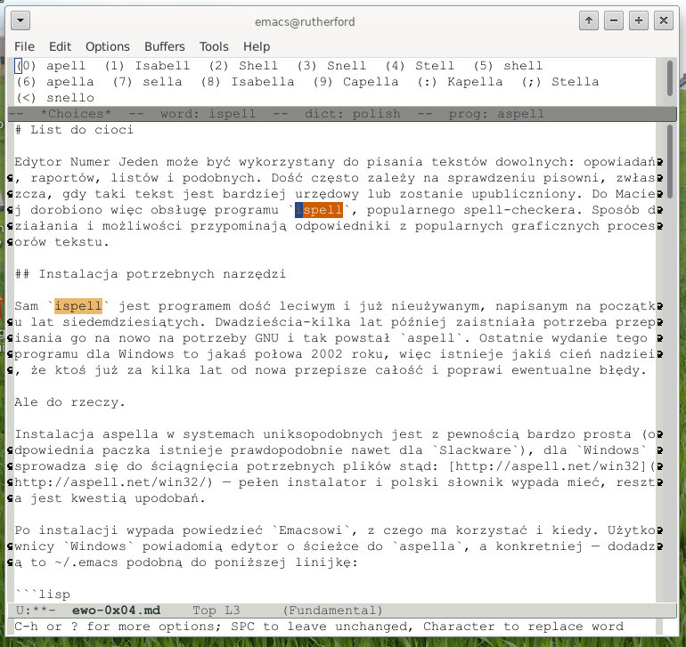
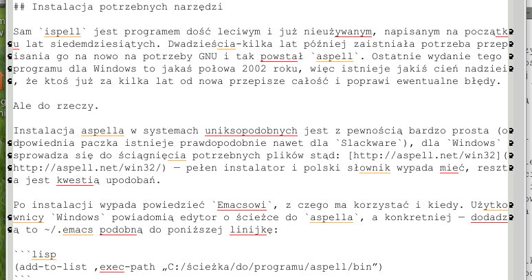

# List do cioci

Edytor Numer Jeden może być wykorzystany do pisania tekstów dowolnych: opowiadań, raportów, listów i podobnych. Dość często zależy na sprawdzeniu pisowni, zwłaszcza, gdy taki tekst jest bardziej urzędowy lub zostanie upubliczniony. Do Emacsa dorobiono więc obsługę programu `ispell`, popularnego spell-checkera. Sposób działania i możliwości przypominają odpowiedniki z popularnych graficznych procesorów tekstu.

## Instalacja potrzebnych narzędzi

Sam `ispell` jest programem dość leciwym i już nieużywanym, napisanym na początku lat siedemdziesiątych. Dwadzieścia-kilka lat później zaistniała potrzeba przepisania go na nowo na potrzeby GNU i tak powstał `aspell`. Ostatnie wydanie tego programu dla Windows to jakaś połowa 2002 roku, więc istnieje jakiś cień nadziei, że ktoś już za kilka lat od nowa przepisze całość i poprawi ewentualne błędy.

Ale do rzeczy.

Instalacja aspella w systemach uniksopodobnych jest z pewnością bardzo prosta (odpowiednia paczka istnieje prawdopodobnie nawet dla `Slackware`), dla `Windows` sprowadza się do ściągnięcia potrzebnych plików stąd: [http://aspell.net/win32](http://aspell.net/win32/) — pełen instalator i polski słownik wypada mieć, reszta jest kwestią upodobań.

Po instalacji wypada powiedzieć `Emacsowi`, z czego ma korzystać i kiedy. Użytkownicy `Windows` powiadomią edytor o ścieżce do `aspella`, a konkretniej — dodadzą to ~/.emacs podobną do poniższej linijkę:

```lisp
(add-to-list ‚exec-path „C:/ścieżka/do/programu/aspell/bin”)
```

ewentualnie pozwolą sobie umieścić ten program na systemowej ścieżce (przed ewentualną ścieżką do `Cygwina`, o ile takowego posiadają)

A wszyscy razem (użytkownicy systemów Uniksopodobnych i Windows) kolejne wyglądające jakoś tak:

```lisp
(setq ispell-program-name "aspell")
(setq ispell-dictionary "polish")
(setq ispell-personal-dictionary "~/my.dictionary")
(require 'ispell)
```

Linijki te są nietrudne do rozszyfrowania:

* ustaw nazwę programu sprawdzającego,
* ustaw domyślny słownik (który później, w trakcie edycji tekstu będzie można zmienić funkcją `M-x ispell-change-dictionary`),
* ustaw osobisty słownik (pewnie przyda się przy dodawaniu własnych wyrazów, nieznajdujących się w oryginalnym słowniku)
* załaduj w ogóle moduł sprawdzania pisowni

## Sprawdzanie napisanego tekstu

`M-x ispell` sprawdza tekst w całym buforze. Jest to funkcja interaktywna, która zaznacza błędnie napisane słowa i proponuje zastąpienie ich którymś z podanych, bądź podjęcie jakieś innej akcji. Dostępne klawisze:

* r/R — zastępowanie słowa innym
* a/A — akceptowanie słowa na czas bieżącej sesji jako poprawne
* i — dodawanie słowa do słownika użytkownika
* l — szukanie słowa w zewnętrznym słowniku
* x/X — wyjście z korekty
* q — zakończenie bieżącej sesji z ispellem
* u — dodanie do prywatnego słownika użytkownika wersji słowa pisanej samymi małymi literami

Wygląda to mniej więcej tak:



* `M-x ispell-buffer` zachowuje się identycznie jak funkcja wyżej
* `M-x ispell-region` ogranicza sprawdzanie pisowni do bieżącego regionu
* `M-x ispell-word` — ogranicza sprawdzanie pisowni do bieżącego słowa.
* `M-x ispell-pdict-save` zapisuje słownik użytkownika (jeśli się zmienił od ostatniego zapisu)

## Sprawdzanie pisowni „w locie”

`M-x ispell-mode` sprawdza wpisywane słowa w locie, ale w sposób dość upierdliwy. Przerywa na chwilę pracę użytkownika i używa brzęczyka systemowego. Na szczęście ten tryb nie występuje we wszystkich wersjach, czysty emacs-cvs go nie posiada, natomiast EmacsW32 już tak.

`M-x flyspell-mode` jest dość ładnie przygotowaną sprawdzaczką pisowni w locie, także opartą o ispella — a co za tym idzie, korzystającą ze wszystkich jego słowników (także użytkownika). Koloruje odpowiednio nieznane (lub znane, ale błędne i tak) słowa:



`M-x flyspell-auto-correct-word` próbuje dokonać autokorekty słowa, zamienia aktualne (błędne) na najbardziej pasujące; każde następne wykonanie tej funkcji w momencie, gdy kursor stoi cały czas w obrębie jednego i tego samego słowa powoduje skorygowanie błędnego słowa następną propozycją ze słownika. Minibufer zawiera aktualnie najlepsze (według ispella) podpowiedzi:

`M-x flyspell-goto-next-error` przesuwa kursor do następnego znalezionego błędnego słowa. Przydatna rzecz, nie trzeba robić tego samemu.

Typowy scenariusz wygląda tak: dla plików tekstowych (na przykład, pasujących do wzorca `"*.txt"`) użytkownik włącza automatycznie `flyspell-mode`, a dwie pozostałe funkcje (`flyspell-autocorrect-word` i `flyspell-goto-next-error`) binduje pod jakieś wygodne klawisze. Wprawdzie `flyspell-goto-next-error` można wywołać drugi raz poprzez `M-TAB`, ale każdy bardziej agresywny menedżer okien na to nie pozwoli.

