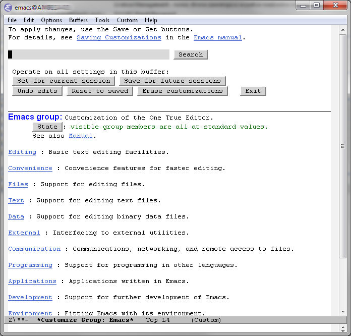
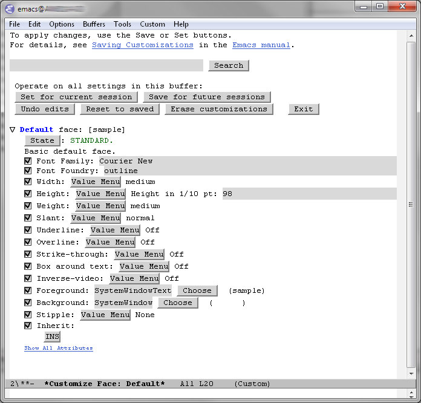

# Wszystko po swojemu

Najlepszy z Edytorów jest programem dość skomplikowanym i rozbudowanym, nie ma co do tego żadnych wątpliwości. Próba skonfigurowania w tradycyjny sposób (okienko dialogowe z setką zakładek i milionem opcji) przyprawiałaby o ból głowy. Mnóstwo cudzego kodu w lispie uczyniłoby pewnie skonfigurowanie Emacsa niewykonalnym. Na szczęście znalazł się odważny człowiek i napisał przydatne narzędzie.

## Customize,

bo o nim mowa, wychodzi z założenia, że wszystkie dostępne opcje trzeba podzielić na odpowiadające im grupy tematyczne, te następnie na podgrupy i tak dalej, w zależności od potrzeb i sensu. Jest to poniekąd słuszne. Początkujący użytkownik Edytora dość szybko odnajdzie to, czego szuka, kierując się opisami grup i opcji, zaawansowany od razu przejdzie do interesujących rzeczy.

* `M-x customize` uruchamia narzędzie, widać grupę główną (zwaną czasem `Emacs group`). Obsługa jest bardzo prosta: bufor z jakąś grupą wygląda mniej więcej tak, jak formularz w przeglądarce www: odnośniki do innych grup/opcji, pola tekstowe, przyciski. Na samej górze można odnaleźć przyciski: Set for Current Session, Save for Future Sessions, Undo Edits, Reset to Saved, Erase Customization, Exit. Dotyczą one wszystkich zmienionych opcji w całej grupie (każda z opcji posiada z boku przycisk State, który pozwala zmienić lub zapamiętać jej stan)
* `M-x customize-group` otwiera bufor z opcjami dla konkretnej grupy. Trzeba znać jej nazwę, gdyż Emacs o nią zapyta w minibuforze, ale (jak zwykle) działa `M-TAB`, więc można wybrać coś z listy (gdy nie jest się do końca pewnym) i z dużym prawdopodobieństwem będzie to właśnie ta grupa
* `M-x customize-option` otwiera bufor z tą jedną, jedyną opcją do zmiany.
* `M-x customize-variable` otwiera bufor umożliwiający ustawienie zmiennej lispowej.
* `M-x customize-face` jest niewielką przeróbką powyższych narzędzi — służy do ustawiania czcionek widocznych podczas pracy z Emacsem.
* `M-x customize-mode` pozwala zmienić wszelkie ustawienia odnośnie danego trybu.

Grupa główna wygląda mniej-więcej tak:

## Jak się tym posługiwać?

Konkretna opcja wymaga od konfigurującego jakiejś właściwej dla niej wartości:

* poprzez zmianę stanu/przełączenie (przyciskiem `Toggle`)
* poprzez wprowadzenie wartości w polu tekstowym (liczbowej, tekstowej, nazwy zmiennej, z której będzie pobierana wartość, wyrażenia regularnego itp)
* poprzez wybór pozycji z menu kontekstowego
* poprzez wybór pozycji z listy wyboru

Przykładowa konfiguracja — domyślna czcionka, używana w edytorze:

## Ale o co chodzi?

Narzędzie narzędziem, ale gdzieś te wszystkie opcje muszą przecież zostać zapisane, zwłaszcza po wybraniu `Save for Future Sessions`. Są zapisywane w `~/.emacs`, ale na tyle sprytnie, że nie powodują zamazania prywatnych rzeczy użytkownika (sprytne, prawda?). Przy starcie wszystko jest ładowane tak samo jak pozostały kod w Lispie — i o to przecież chodziło.
