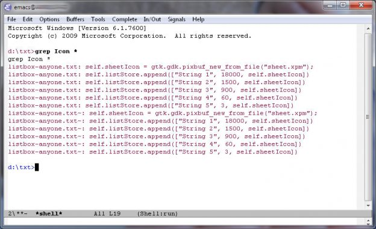
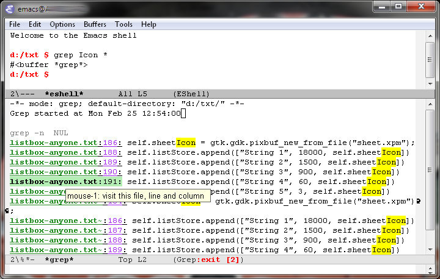
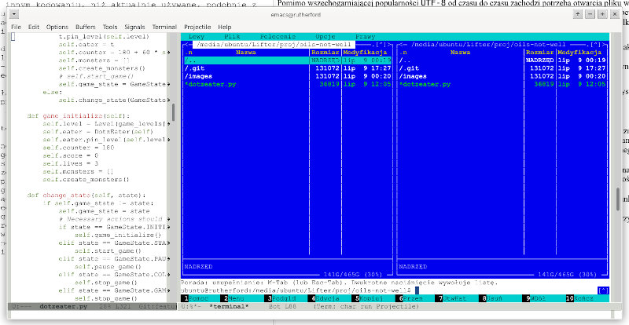

# Uruchomić coś?

Podczas pracy ze zwykłym edytorem tekstu często trzeba sięgać do terminala, aby wykonać jakieś operacje na plikach i katalogach, uruchomić jakiś program lub też skompilować pisane przez siebie źródła. Emacsowcy mają ten komfort, że odpowiednie narzędzia zostały już wbudowane w ich ulubiony program.

## Shell

Zwykły wiersz poleceń można otworzyć w nowym oknie funkcją `M-x shell` — w systemach uniksowych uruchamiana jest powłoka użytkownika, w Windows NT i pochodnych — `cmd.exe`

Ekstrawagancja? Niekoniecznie. Taka powłoka jest pełnoprawnym emacsowym buforem, można w nim chociażby wygodnie wyszukiwać, kopiować, wyświetlać w oknie obok i tak dalej. Przede wszystkim: nie trzeba wychodzić z Edytora ani zawieszać go na czas wykonywania jakichś innych poleceń:

### Powłoka, jaka jest, każdy widzi

Powłoka systemu `Windows NT` nie jest — delikatnie mówiąc — najwygodniejsza w użyciu (podobnie jak w systemach takich jak `Solaris` i podobnych), ale od czego są zdolni programiści Lispa: wraz z wersją 21 Edytora przychodzi `Eshell`, najwygodniejsza z powłok, jakie tylko można było wymyślić (no dobra, `bash` razem z completion mogą od biedy być konkurencją); dokładną dokumentację można znaleźć tutaj: [http://www.gnu.org/software/emacs/manual/html_mono/eshell.html](http://www.gnu.org/software/emacs/manual/html_mono/eshell.html). Takie podejście ma same zalety, choćby zunifikowanie powłoki pod wszystkimi możliwymi systemami (odpada poznawanie funkcjonalności innych)

Z ciekawszych rzeczy warto odnotować przykrywanie niektórych komend/programów swoimi funkcjami interaktywnymi. Przykładowo, wywołanie `grepa` uruchomionego w oknie `eshella` skutkuje otwarciem okna z rezultatem wyszukiwania (i to jakim: kolorowe komunikaty, odnośniki do poszczególnych linii w pliku i podobne):

Po kliknięciu na nazwę pliku zostanie on otwarty, i to od razu w podanej linii

## Uruchamianie programów

Jeśli nie ma potrzeby otwierania shella specjalnie po to, aby uruchomić jakiś program, można skorzystać z funkcji `M-x shell-command` (domyślnie przypisano do niej kombinację `M-!`; `Emacs` uruchamia podany program i przechwytuje jego wyjście, umieszczając je w buforze Shell Command Output

### Przekazywanie danych

W sytuacjach, gdy program potrzebuje jakichś danych wejściowych, pobieranych ze standardowego wejścia, można sobie pomóc funkcją `M-x shell-command-on-region` (domyślnie przypisano do niej kombinację `M-|`) — dane pobierane są z bieżącego regionu.

## Emulator terminala

`Midnight Commander` w jednym z emacsowych buforów — niemożliwe? A jednak. Funkcja `M-x term` uruchamia w nowym buforze pełnoprawny emulator terminala. Można do woli uruchamiać choćby wszystkie programy, korzystające z biblioteki ncurses, chociaż taka funkcjonalność wydaje się być dyskusyjna.

## Konfiguracja

Grupy `shell` i `term` zawierają mnóstwo opcji związanych z konfiguracją zarówno wiersza poleceń jak i emulatora terminala. Warto poczytać dokładny opis, jak i odpowiednie rozdziały w podręczniku.
