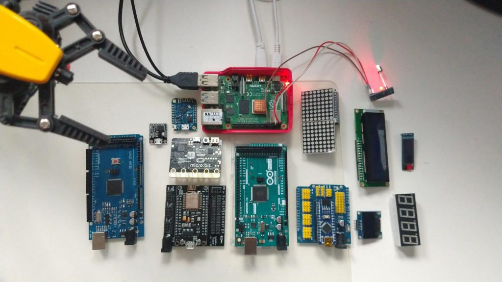

# Kryzys wieku średniego

Kryzys wieku średniego poza IT:

* kupujesz różowego cadillaca
* podrywasz na niego studentki ASP
*wieczory spędzasz z kolegami w pubie
*robisz inne, równie nieodpowiedzialne rzeczy

Kryzys wieku średniego w IT:

* kupujesz całe stado mikrokontrolerów za przysłowiową czapkę śliwek
* podrywasz tyłek z kanapy, żeby ze wszystkiego zrobić inteligentny dom albo nietypowego robota
* popołudnia spędzasz z synem, ciekawym, jak to wszystko działa
* po szychcie pędzisz do domu, żeby wypróbować wskazówki kolegów z pracy

