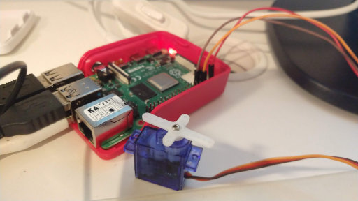
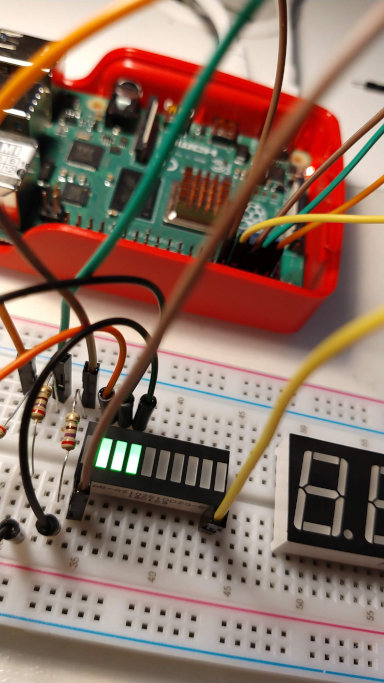

# Raspberry Pi i diody

`Raspberry Pi` nadeszło jako pierwsze i zostało już na biurku jako podstawowa stacja robocza, zamiast dwudziestokrotnie droższego komputera z `x86` w środku.

## Pierwsze wrażenia

Debian (*Raspbian*), 4GB RAM, HDMI, WiFi, Bluetooth, a na karcie μSD jakieś 32GB miejsca. Do przysłowiowego szczęścia nie potrzeba już niczego więcej, lista narzędzi nie zmienia się od piętnastu lat i wszystko działa zgodnie z oczekiwaniami.

Co jeszcze przynosi ze sobą ta płytka? Czterdzieści pinów ogólnego przeznaczenia (`GPIO` -- General Purpose Input/Output) -- to właśnie ten szał, który robi różnicę. Zasilanie, I²C, 1-Wire, itd, itp -- do wyboru, do koloru.

Żyć, nie umierać, bo podłączyć można chyba absolutnie wszystko.

_Raspy_, przedstaw się państwu:




## Po kilku miesiącach

Zalecany system operacyjny jest, póki co, 32-bitowy, więc po jakichś kilkunastu próbach uruchomienia czegoś zbudowanego dla `aarch64` wycofałem się do 32-bitowego Ubuntu (a nawet do wersji rozwojowej). 64-bitowe obrazy najczęściej nie chciały się uruchamiać, z rzadka (Ubuntu) wieszały się po zainstalowaniu choćby `XFCE` i login managera.

Repozytorium Ubuntu wydaje się nie mieć dna, chwilowo Raspbiana nie brakuje, więc bieżąca konfiguracja wytrzyma jeszcze przynajmniej pół roku.


## GPIO

Pierwszą rzeczą, którą robi domorosły elektronik, jest z pewnością mruganie kolorowymi diodami, niech będzie, że można od razu podłączyć linijkę led typu `AB-AS102510DSG-B` (wspólna katoda). Nie trzeba w tym celu zasiadać do kompilatora, pinami `GPIO`  można sterować przy pomocy mechanizmów uniksowych (a tam wszystko jest plikiem, prawda?)

Raspbian wystawia plikowy dostęp do pinów `GPIO` w katalogu `/sys/class/gpio`. Najpierw dany pin trzeba *wyeksportować*, na przykładzie pinu numer 2:

`$ echo 2 > /sys/class/gpio/export`

później powiedzieć mu, że będzie pinem *wyjściowym*:

`$ echo out > /sys/class/gpio/gpio2/direction`

i ustawić w końcu żądaną wartość:

`$ echo 1 > /sys/class/gpio/gpio2/value`

(albo 0, w zależności od potrzeb)

Przykładowe trzy anody zostały podłączone do pinów `GPIO2`, `GPIO3` oraz `GPIO17` (fizyczną kolejność na płytce najlepiej sprawdzić poleceniem `pinout` albo [tutaj](https://pinout.xyz/)), a katody do `GPIO14` i `GPIO15`:

``` shell
#!/bin/bash

ANODES="2 3 17"
CATHODES="14 15"

on()
{
  PIN=$1
  echo 1 > /sys/class/gpio/gpio${PIN}/value
}

off()
{
  PIN=$1
  echo 0 > /sys/class/gpio/gpio${PIN}/value
}

enable()
{
  PIN=$1
  echo ${PIN} > /sys/class/gpio/export
  sleep 1
  echo out > /sys/class/gpio/gpio${PIN}/direction
  sleep 1
}

# Setup
for ANODE in ${ANODES}
do
  enable ${ANODE}
done

for CATHODE in ${CATHODES}
do
  enable ${CATHODE}
done

while :
do
  for CATHODE in ${CATHODES}
  do
    on ${CATHODE}
  done
  for ANODE in ${ANODES}
  do
    on ${ANODE}
    sleep 1
  done
  off 14
  for ANODE in ${ANODES}
  do
    off ${ANODE}
    sleep 1
  done
  off 15
  on 14
  for ANODE in ${ANODES}
  do
    on ${ANODE}
    sleep 1
  done
  for ANODE in ${ANODES}
  do
    off ${ANODE}
    sleep 1
  done
done
```

Mrugają jak szalone:




