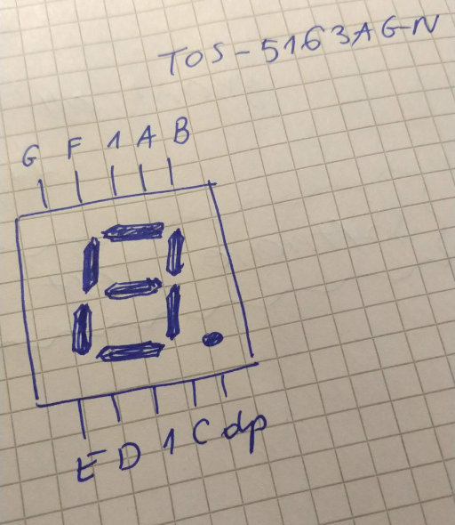

# RPi.GPIO i wyświetlacz 1x7 ze wspólną katodą

`RPi.GPIO` jest doskonałą biblioteką do sterowania pinami `GPIO` dla języka `Python` (możnaby powiedzieć, że wartą swojej ceny, z tym, że akurat nic nie kosztuje); można ją przećwiczyć w działaniu na wyświetlaczu siedmiosegmentowym, bo [linijka diodowa](/kws-0x02) jest fajna na krótką metę, a znajomość działania wyświetlacza segmentowego przyda się tak, czy siak.

## Wyświetlacz

Testowanym wyśwletlaczem jest `TOS-5163AGN` &mdash; z pojedynczą cyfrą (siedem segmentów), kropką dziesiętną i wspólną katodą.

Wspólna katoda oznacza tu, że należy podać na połączony z nią pin `GPIO` sygnał niski (jeśli cyfra ma być w ogóle włączona), a na pozostałe anody &mdash; sygnał wysoki (w zależności od potrzeb, oczywiście.

Nóżki wyświetlacza przypisane są do odpowiednich segmentów jak na rysunku poniżej.



## Biblioteka RPi.GPIO

Biblioteka znajduje się zarówno w repozytorium `Raspbiana` (a nawet przychodzi razem z nim w domyślnej instalacji), jak i `Ubuntu` (innych dystrybucji na razie nie próbowałem): tutaj z kolei trzeba
```sh
apt-get install python3-rpi.gpio
```

Pierwszą rzeczą zwykle jest poinformowanie biblioteki o wybranym trybie:
```python
import RPi.GPIO as GPIO

GPIO.setmode(GPIO.BCM)
```

`BCM` oznacza tutaj numery logiczne, nadane przez _Broadcom_ zamiast numerowania kolejnych wyprowadzeń (ten tryb z kolei można wymusić stałą `GPIO.BOARD`)

Numery logiczne pozostają stałe po choćby przeprojektowaniu układu pinów na płytce -- wtedy funkcje wyprowadzeń będą te same (tak przynajmniej gwarantuje  producent); odpowiedni kawałek programu używającego tej biblioteki może być wtedy śmiało wykorzystany bez zastanawiania się, który właściwie pin robi w ogóle co.

Poniżej zdefiniowałem podłączenia kolejnych segmentów wyświetlacza:
```python
s_a = 14
s_b = 15
s_c = 18
s_d = 23
s_e = 24
s_f = 25
s_g = 8
s_dp = 7
s_common = 1
```

`s_common` to wspólna katoda, `s_dp` to kropka dziesiętna

Każdy z użytych pinów będzie _pinem wyjściowym_, więc o tym także trzeba poinformować system:

```python
GPIO.setup(s_a, GPIO.OUT)
```

(i tak dalej, dla każdego pinu)

Samo podawanie wartości na pin jest również proste:
```python
GPIO.output(s_a, GPIO.HIGH)
```

lub:
```python
GPIO.output(s_a, GPIO.LOW)
```

Cykliczne wyświetlanie cyfr mogłoby wyglądać wówczas jak poniżej:

```python
#!/usr/bin/env python

import RPi.GPIO as GPIO
from time import sleep

s_a = 14
s_b = 15
s_c = 18
s_d = 23
s_e = 24
s_f = 25
s_g = 8
s_dp = 7
s_common = 1

s_digit = [s_common]
s_segments = [s_a, s_b, s_c, s_d, s_e, s_f, s_g]
s_all = s_digit + s_segments + [s_dp]

s_enc = {
    '0': [s_a, s_b, s_c, s_d, s_e, s_f],
    '1': [s_b, s_c],
    '2': [s_a, s_b, s_d, s_e, s_g],
    '3': [s_a, s_b, s_c, s_d, s_g],
    '4': [s_b, s_c, s_f, s_g],
    '5': [s_a, s_c, s_d, s_f, s_g],
    '6': [s_a, s_c, s_d, s_e, s_f, s_g],
    '7': [s_a, s_b, s_c],
    '8': [s_a, s_b, s_c, s_d, s_e, s_f, s_g],
    '9': [s_a, s_b, s_c, s_d, s_f, s_g],
    }

def seg_on(seg):
    GPIO.output(seg, GPIO.HIGH)

def seg_off(seg):
    GPIO.output(seg, GPIO.LOW)

if __name__ == "__main__":
    GPIO.setwarnings(False)
    GPIO.setmode(GPIO.BCM)
    for s in s_all:
        GPIO.setup(s, GPIO.OUT)
    # cathode to low:
    GPIO.output(s_common, GPIO.LOW)
    try:
        while True:
            for elems in s_enc:
                seg_off(s_dp)
                for s in s_segments:
                    if s not in s_enc[elems]:
                        seg_off(s)
                    else:
                        seg_on(s)
                sleep(0.5)
                seg_on(s_dp)
                sleep(0.5)
    except KeyboardInterrupt:
        GPIO.cleanup()
```


