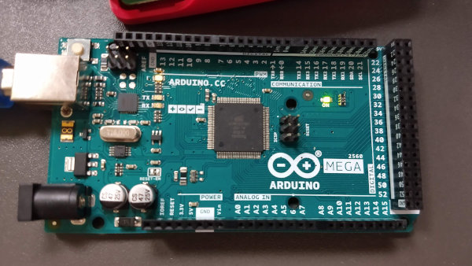
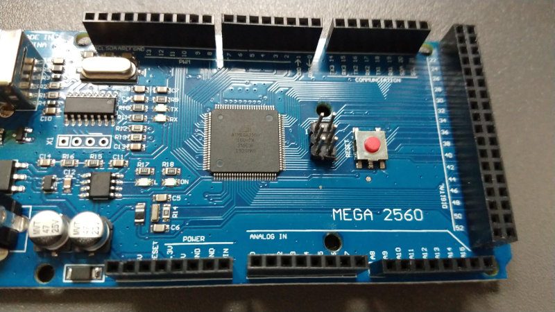
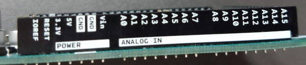
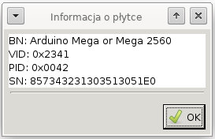

# Arduino

_Arduino_ to jedna z najciekawszych płytek rozwojowych, przeznaczona dla hobbystów -- pasjonatów elektroniki, oparta o mikrokontroler Atmel AVR. Możliwe jest podłączenie chyba dowolnego podzespołu elektronicznego, jaki się tylko zamarzy.

Urządzenie programuje się bezboleśnie dzięki eleganckiemu IDE, w którym pisze się w podzbiorze języków C i C++, a gotowy kompilat przesyłany jest później do mikrokontrolera poprzez kabel USB.

Arduino IDE działa bezbłędnie w systemach Windows, Linux i MacOSX (najciekawsze połączenie to razem z _Raspberry Pi_ jako hostem)

Projekt platformy prowadzony jest na zasadzie pełnej otwartości -- każdy może stworzyć swojego własnego klona _Arduino_ (z czego skwapliwie korzystają chińskie firmy, oferując swoje urządzenia nawet pięciokrotnie taniej, niż te wyprodukowane we Włoszech); od momentu pierwszego prototypu minęło już piętnaście lat, a co za tym idzie -- powstało dobrych kilkadziesiąt modeli, dostosowujących się możliwościami i budową do tego, co obecnie oferuje rynek.

Przykłady, które znajdą się tutaj, będą uruchamiane przy pomocy Arduino Mega2560.

Oryginalne `Arduino`:



Klon:



Decydująca przy zakupie wydaje się być tylko kwestia finansowa, zarówno oryginały, jak i klony działają świetnie. Różnica jest głównie w wyglądzie (tańsza wersja nie ma tak ładnie podpisanych pinów) i zawartości opakowania.



Aha, no i jeszcze _Arduino IDE_ powie, co to za płytka:




## Arduino IDE

Ze strony [https://www.arduino.cc/en/Main/Software](https://www.arduino.cc/en/Main/Software) należy ściągnąć wersję właściwą dla danego systemu operacyjnego.

Wersje dla Windows i Linuksa to po prostu archiwa do rozpakowania: gdzieś tam w środku czai się albo program wykonywalny albo skrypt powłoki do uruchomienia. 

Wersja dla MacOSX to spakowana standardowa aplikacja, którą należy przeciągnąć do `/Applications`

## Mruganie wbudowaną diodą

Pierwszy, podstawowy _Hello World_ dla Arduino nie wymaga niczego oprócz samej płytki i kabla USB -- można wykorzystać wbudowaną diodę do mrugania (cyklicznego podawania stanu wysokiego lub niskiego na odpowiedni pin)

Przykład taki już istnieje i przychodzi razem z całym środowiskiem -- wystarczy pogrzebać w menu _Plik_ -> _Przykłady_ -> _01. Basics i wybrać _Blink_, którego treść (po usunięciu komentarzy i copyrightów) wygląda mniej więcej tak:

```C
void setup() {
  pinMode(LED_BUILTIN, OUTPUT);
}

void loop() {
  digitalWrite(LED_BUILTIN, HIGH);
  delay(1000);
  digitalWrite(LED_BUILTIN, LOW);
  delay(1000);
}
```

Konstrukcja programów dla _Adruino_ jest dokładnie taka sama: jedna funkcja inicjalizująca (`setup()`) i jedna działająca _w kółko_ (`loop()`) -- to dość istotna wiedza, czasami dopiero odpięcie zasilania lub przycisk reset przynosi wybawienie.

W funkcji `loop()` nie trzeba umieszczać już własnych konstrukcji zapętlających, skoro sama funkcja jest zapętlona w nieskończoność.

Funkcje użyte w przykładzie:
* `pinMode` -- ustawia pin o danym numerze (tu: `LED_BUILTIN`) jako wyjściowy,
* `digitalWrite` -- ustawia określonemu pinowi podany stan (niski bądź wysoki)
* `delay` -- pauzuje przez podaną liczbę milisekund.
