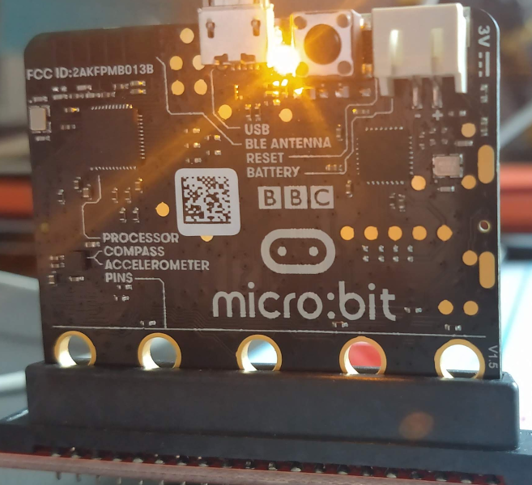
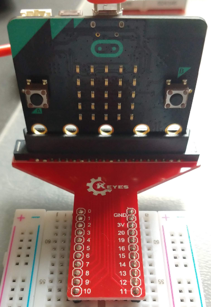

# BBC micro:bit

_micro:bit_ to kolejna płytka rozwojowa do celów edukcyjnych, dość niewielka, ale o sporych możliwościach. _BBC_ oznacza tu dokładnie to, co oznacza -- brytyjskiego narodowego operatora medialnego (potwierdza to gustowne logo na płytce)



Płytkę wystarczy podłączyć do większego komputera przy pomocy USB (nie udało mi się z RaspberryPi, ale dowolna maszyna z Windows lub MacOSX powinna wystarczyć), zainstalować choćby [Mu Editor](https://codewith.mu/en/download)

(Sam program jest na tyle zacny, że umożliwia bez większych przeszkód po prostu pisanie w jednym z kilku wybranych trybów: czysty Python, tryb _micro:bit_, tryb ESP8266 (_MicroPython_), _Pygame Zero_, _Circuit Python_ oraz tworzenie prostych webserwisów w _Flask_; dla każdego trybu dostępne są jakieś ciekawe narzędzia, itd)


Przednia strona _micro:bita_ zawiera dwa przyciski (_A_ i _B_) dowolnego przeznaczenia oraz 25 diod _LED_, pogrupowanych w 5 wierszy po 5 elementów -- te właśnie diody można wykorzystać do sprawdzenia, czy _micro:bit_ działa i robi to, co mu każemy:



Standardowa biblioteka do obsługi _micro:bit_ potrafi wyświetlić przy pomocy tych diód wszystko, bądź prawie wszystko (brak polskich znaków narodowych, ale nie wymagajmy cudów); niech pierwszą rzeczą będzie przesuwający się napis:

```python
from microbit import *
from time import sleep

while True:
    display.scroll("Witaj swiecie!")
    time.sleep(1)
```

Kod chyba nie wymaga jakiegoś większego komentarza, gotowy obiekt `display` robi to, co powinien robić (przesuwa napis); tak właśnie ma być -- prosta (w obsłudze) biblioteka do zabawy z prostą (w obsłudze) płytką.
